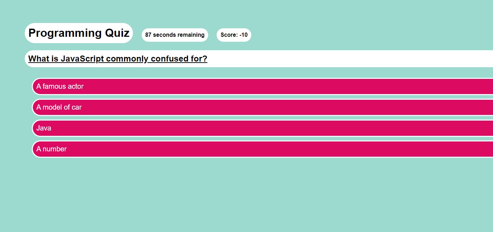

# Module-4-Quiz-Challenge

This repository is my fourth challenge of many to complete within the UofT coding bootcamp I'm taking part of. 
The assignment is to create a JavaScript related quiz to meet the assignment's Acceptance Criteria.
The first part of this is the User Story which is as follows:

## User Story

AS A coding boot camp student
I WANT to take a timed quiz on JavaScript fundamentals that stores high scores
SO THAT I can gauge my progress compared to my peers

## Acceptance Criteria

The Acceptance Criteria is as follows:

GIVEN I am taking a code quiz
WHEN I click the start button
THEN a timer starts and I am presented with a question
WHEN I answer a question
THEN I am presented with another question
WHEN I answer a question incorrectly
THEN time is subtracted from the clock
WHEN all questions are answered or the timer reaches 0
THEN the game is over
WHEN the game is over
THEN I can save my initials and score

## To Put It Simply

The assignment is to create a quiz which tracks time, score, and allows the user to submit and save a highscore, looking something like this

## Link To Deployed Application
https://benbasic.github.io/Module-4-Quiz-Challenge/

